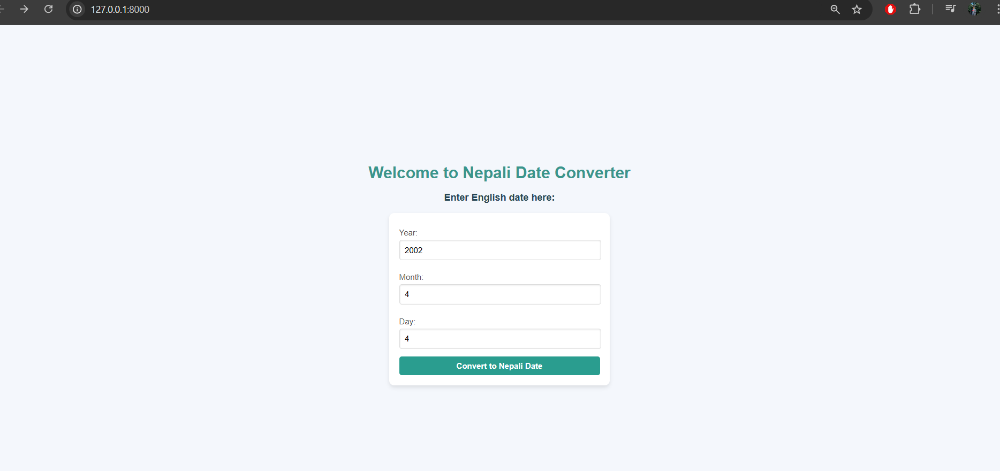
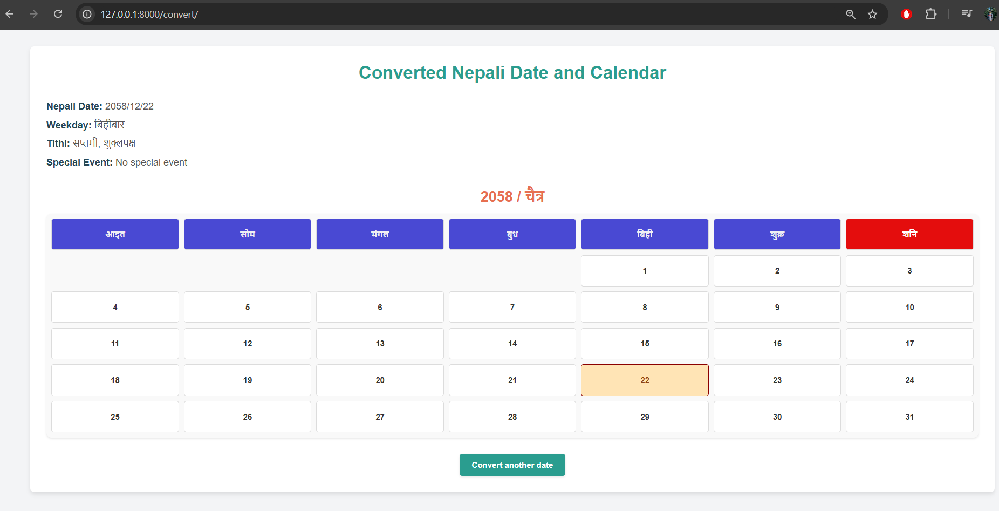

# Nepali Date Converter

This is a Django-based web application that converts an English date into a Nepali date and displays the corresponding Nepali calendar with additional information like the weekday, Tithi, and any special events. The application features a visually appealing and interactive calendar.

---

## Features

- Converts English dates to Nepali dates.
- Displays the corresponding weekday in Nepali.
- Includes Tithi and special events information.
- Dynamic Nepali calendar generation for the month of the converted date.
- Highlights the converted Nepali date in the calendar.
- Custom styling for Saturdays ("\u0936\u0928\u093f") and other weekdays.

---

## Project Structure

```
project-root/
|-- converter/
|   |-- migrations/
|   |-- static/
|   |   |-- converter/
|   |       |-- result.css
|   |-- templates/
|   |   |-- converter/
|   |       |-- index.html
|   |       |-- result.html
|   |-- __init__.py
|   |-- admin.py
|   |-- apps.py
|   |-- models.py
|   |-- tests.py
|   |-- views.py
|-- nepali_calendar/
|   |-- __init__.py
|   |-- asgi.py
|   |-- settings.py
|   |-- urls.py
|   |-- wsgi.py
|-- db.sqlite3
|-- manage.py
|-- README.md
```

---

## Requirements

- Python 3.8+
- Django 4.x

---

## Installation

1. Clone the repository:
   ```bash
   git clone https://github.com/your-username/nepali-date-converter.git
   cd nepali-date-converter
   ```

2. Create and activate a virtual environment:
   ```bash
   python -m venv venv
   source venv/bin/activate # For Linux/Mac
   venv\Scripts\activate  # For Windows
   ```

3. Install dependencies:
   ```bash
   pip install -r requirements.txt
   ```

4. Run database migrations:
   ```bash
   python manage.py migrate
   ```

5. Start the development server:
   ```bash
   python manage.py runserver
   ```

6. Open your browser and navigate to:
   ```
   http://127.0.0.1:8000/
   ```

---

## Usage

1. Enter an English date on the homepage.
2. Submit the form to view the corresponding Nepali date.
3. The result page displays:
   - The converted Nepali date.
   - The corresponding weekday in Nepali.
   - The Tithi and any special events.
   - A dynamic calendar with:
     - "\u0936\u0928\u093f" (Saturday) styled in red.
     - Other weekdays styled in blue.
     - The converted Nepali date highlighted with a distinct color.

---

## Screenshots

### Homepage


### Result Page



---

## Contributing

Feel free to fork this repository, create a feature branch, and submit a pull request. Any contributions are welcome!

---

## License

This project is licensed under the MIT License. See the LICENSE file for details.

---

## Acknowledgments

- Inspired by the traditional Nepali calendar and lunar calculations.
- Developed using Django and Python.
